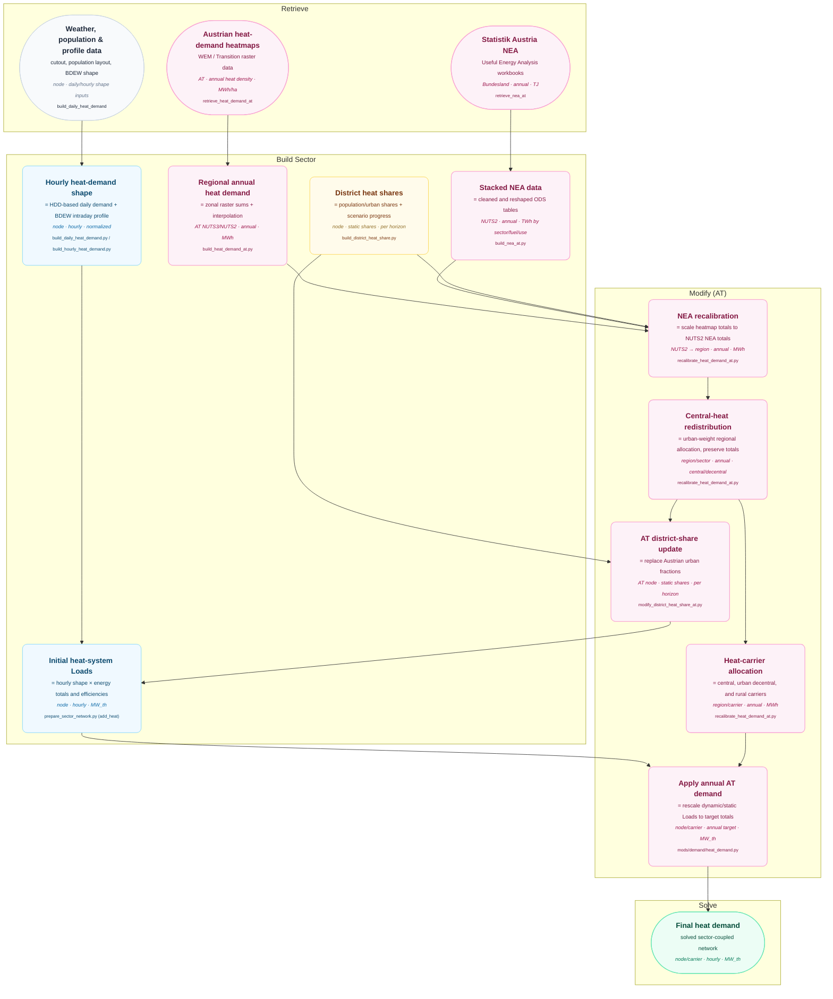

# Heat Demand

This diagram traces heat demand from the shared weather-based heat profile and the
Austrian heat-demand datasets to the heat Loads used by the model. Violet nodes are
Austrian-specific; blue and amber nodes are inherited or shared workflow steps. See
[Data Flow Diagrams](index.md) for the diagramming convention.

## AT-Specific Processing

- **Heatmaps to regional demand.** The retrieved rasters contain heat density in MWh/ha.
  The workflow selects Austrian NUTS3 regions, or NUTS2 regions for AT10 clustering,
  sums raster cells with zonal statistics, and linearly interpolates between the available
  source years to the configured planning horizons.
- **NEA preparation.** One Statistik Austria ODS workbook per Bundesland is cleaned,
  reshaped from wide tables into long records, converted from TJ to TWh, and labelled with
  NUTS2 code, sector, useful-energy category, and energy carrier.
- **Recalibration.** Household and service records for space/water heat and low/high
  temperature process heat are grouped by NUTS2, sector, and central/decentral heating.
  Each group supplies a scaling factor that changes the heatmap-based regional totals while
  retaining their spatial pattern.
- **Redistribution and allocation.** Central heat is redistributed within each NUTS2
  sector group using regional heat demand and urban fractions. Decentral heat is adjusted so
  regional sector totals remain unchanged, then split into central, urban decentral, and
  rural carriers. The resulting urban fractions are also exported for the district-share
  update.
- **Network application.** The AT district-share file is used while building heat-system
  Loads. During the modify phase, the AT carrier totals replace the initial annual totals;
  dynamic Loads keep their hourly shape while static Loads are set directly from the annual
  target.
- **Limitations** Since Austrian Heatmaps provides overall data for austria including industry,
  transport, households and services, this code assumes a correlated future development of
  those demands.
