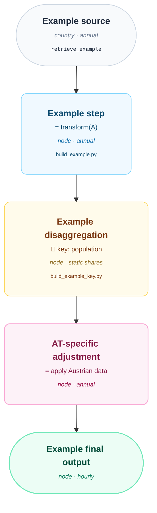

# Data Flow Diagrams

This section documents how data moves from its original raw source through the
PyPSA-Eur / PyPSA-DE / PyPSA-AT workflow phases. The phases follow the rules
retrieve → build_electricity / build_sector → modify → solve to the final network
component that is used in the optimization. Each data flow is illustrated with a
Mermaid diagram.

## Convention

All data-flow diagrams in this section follow the same structure so they stay easy to
compare and maintain.

### Layout

- `flowchart TD` (top-down): source data at the top, final network component at the bottom.
- One `subgraph` per relevant workflow phase or rule: `retrieve`, `build_electricity` /
  `build_sector`, `prepare_sector_network_at`, `modify_at`, `solve`. Skip phases that
  don't apply.
- Steps within a phase are chained top-to-bottom in order of execution.

### Node types and styling

Four node classes and one AT-specific highlight, defined once per diagram via `classDef` are used
and applied with `:::class`. All diagrams use the same **soft, flat, rounded-corner palette**
so the color code is consistent and only needs to be learned once:

| Class       | Meaning                                                       | Color                  |
|-------------|----------------------------------------------------------------|------------------------|
| `source`    | Original raw data source (external dataset)                   | neutral slate          |
| `step`      | A plain processing/transformation step (no scenario parameters) | soft sky blue          |
| `aggstep`   | A step that aggregates or disaggregates data — has scenario-relevant parameters worth calling out | soft amber |
| `final`     | The final data / network component consumed by `solve`         | soft emerald green     |
| `at`        | An Austrian-specific source or processing step                 | soft violet            |

The `at` class is an ownership highlight rather than a new data shape. It is used for
AT-specific sources and transformations; the node syntax still distinguishes data-at-rest
(sources and final output) from processing steps. Shared upstream steps keep their 
`source`, `step`, or `aggstep` class.

Shapes reinforce the same distinction: **rounded/pill nodes** (`(["..."])`) mark
data-at-rest (sources and final output), **rounded rectangles** (`["..."]` with `rx/ry` in
the `classDef`) mark transformations in between. So at a glance: slate pill → blue/amber/
violet rounded boxes → green pill.

### Node content

Keep nodes conceptual and scannable — not a full code index — but do surface enough
provenance that a reader can jump into the code. Each node label has up to **four visual
tiers**, largest/boldest to smallest/lightest:

1. **Title** (bold, ~15px): what the data is, e.g. `<b>Production per country</b>`
2. **Transformation** (regular, ~12px): one short phrase, e.g. "= production ×
   distribution key"; for `aggstep` nodes, lead with the key parameter(s) instead, e.g.
   "📍 disaggregate by site location, fallback: population"
3. **Shape annotation** (italic, ~11px, muted color matching the class): the rough shape
   of the data leaving this node — spatial resolution (country / NUTS3 / node / bus /
   site-level) and temporal resolution (static, annual, monthly, hourly, constant), e.g.
   `country · annual · kt/a`. Keep it to 2-4 short terms separated by `·`.
4. **Source reference** (monospace, ~9.5px, lightest muted color): the Snakemake rule
   name, script filename, or config/data path where this transformation or its parameters
   live — no line numbers, no directory paths unless needed to disambiguate, e.g.
   `build_industrial_distribution_key.py` or `retrieve_jrc_idees`. Omit this tier for
   nodes where it adds no value (e.g. a pure final-output node).

Skip exact data shapes (index/columns), full unit tables, and intermediate
calibration/helper steps unless they materially change the reader's understanding of the
flow — merge minor steps into the node that best represents the conceptual
transformation. Aim for **8-12 nodes total** per diagram; if you need more, group them
into `subgraph`s rather than adding more detail per node.

Write node labels as **inline HTML** inside a normal quoted label (not Mermaid markdown
strings) — `<b>`, ` `, `<i>`, and `` all render because
Mermaid/mkdocs-material flowcharts have `htmlLabels` enabled by default. This is what lets
each of the four tiers get its own font size and color, which markdown strings alone
cannot do.

Always wrap the whole label in an inner `
` (rather than relying
only on the global `flowchart.padding`). Stadium/pill-shaped nodes (`(["..."])`) need more
padding than rounded rectangles (`["..."]`) at the same `flowchart.padding` value, because
the curved ends eat into the available space near the top/bottom of the text — without
the inner `
`, pill nodes end up with text sitting noticeably closer to the border
than rectangular ones. Use `padding:12px 26px` for pill nodes (`source`/`final`) and
`padding:10px 18px` for rectangular nodes (`step`/`aggstep`) as the standard values.

### File convention

- One Markdown file per data flow: `docs-at/explanations/data-flows/<topic>.md`
- Each file contains a short intro paragraph, the Mermaid diagram, and (optionally) a
  brief narrative walkthrough of noteworthy steps below the diagram.
- Register new files under **Explanations → Data Flows** in `mkdocs.yml`.
- When a flow contains PyPSA-AT related sources or transformations, highlight them with the
  `at` class and keep the class definition identical to the one above.

## Available diagrams

- [Industrial Demand](industrial-demand.md)
- [Heat Demand](heat-demand.md)
- [Road Mobility Demand](road-demand.md)
