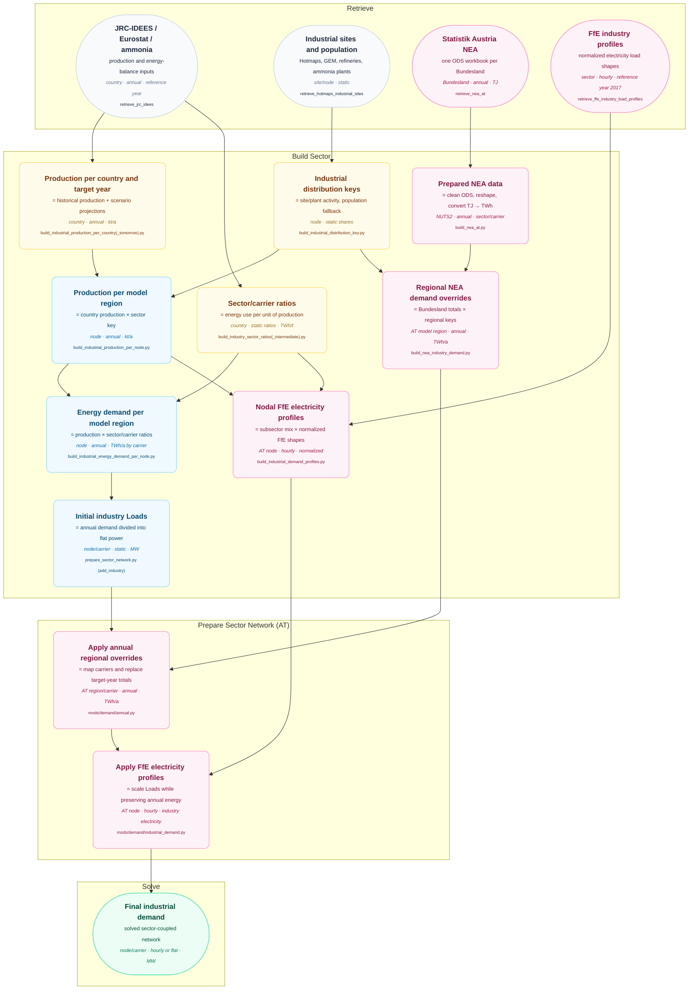

# Industrial Demand

This diagram traces the generic industrial-demand build and the Austrian regional NEA (Nutzenergieanalyse)
override to the final network Loads. Violet nodes are Austrian-specific. See [Data Flow
Diagrams](index.md) for the shared diagram convention.

## AT-Specific Processing

- **NEA preparation:** The Bundesland ODS files are cleaned, reshaped to long form, tagged
  with NUTS2 codes, and converted from TJ to TWh. The override currently selects the
  `Produzierender Bereich` category and maps NEA carriers to model Load carriers.
- **Regional allocation:** NEA totals are aggregated by Bundesland, sector, carrier, and
  selected distribution key. They are allocated to Austrian model regions using the matching
  industrial key, with population as fallback. `AT333` is assigned to parent NUTS2 region
  `AT33` for this allocation.
- **Load application:** For configured target years (currently 2025), regional annual totals
  replace matching industry Loads. Static Loads receive flat power; dynamic Loads are scaled
  to preserve their time shape and annual target.
- **Electricity profiles:** When enabled, FfE profiles are weighted by each region's
  subsector electricity mix and applied to `industry electricity`, preserving its annual
  energy while making it time-varying. Other industry carriers remain flat unless another
  profile is configured.
