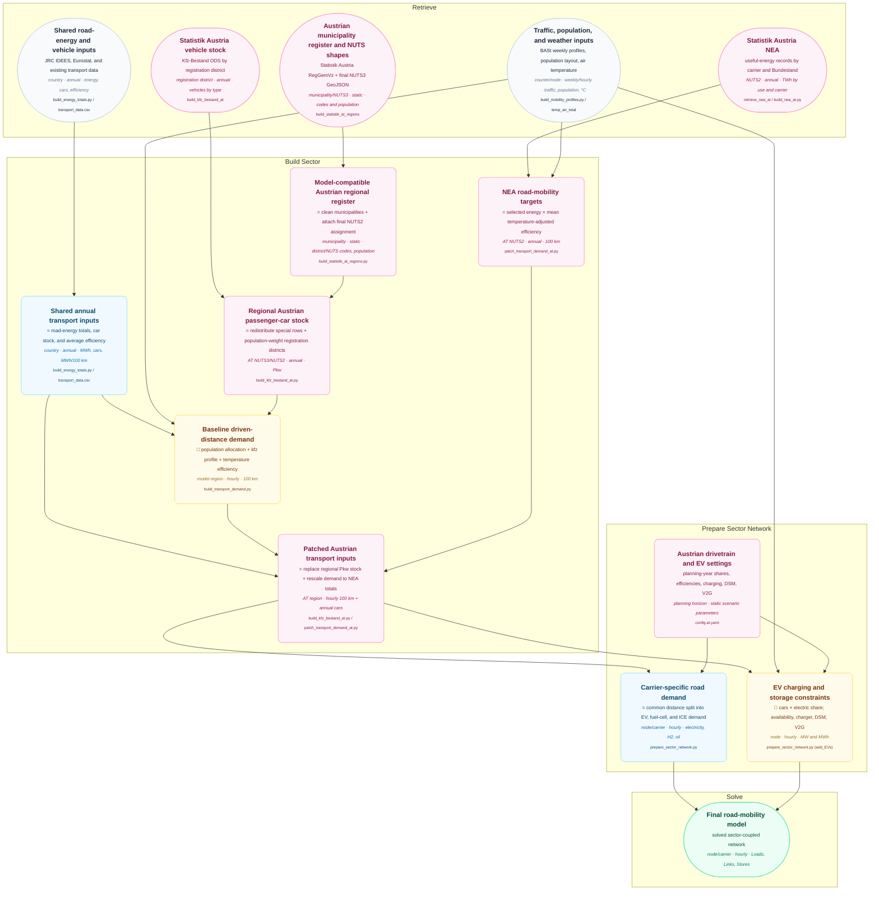

# Road Mobility Demand

This diagram traces the shared road-mobility build and the Austrian vehicle-stock and
Nutzenergieanalyse (NEA) overrides to the final transport Loads, Links, and Stores.
Violet nodes are Austrian-specific; blue and amber nodes are inherited or shared workflow
steps. See [Data Flow Diagrams](index.md) for the shared diagram convention.

## AT-Specific Processing

- **Regional reference data.** The Statistik Austria municipality workbook is read from
  the `Gemeinden` sheet, forward-filled, restricted to valid municipality records, and
  renamed to machine-readable columns. The final NUTS3 shapes supply the model-compatible
  NUTS2 assignment. Missing NUTS2 mappings stop the build rather than silently dropping
  municipalities.
- **Vehicle-stock preparation.** The district-level Kfz workbook is cleaned by removing
  source notes and national or Bundesland totals and by converting `-` entries to zero.
  Vehicles reported for `Post`, `Bahn`, and
  `Polizei, Justizwache, Finanzverwaltung` are redistributed proportionally across the
  geographic registration districts, separately for each vehicle category.
- **Registration-district mapping.** Municipality records are translated to vehicle
  registration names, including special handling for Eisenstadt/Rust, Klosterneuburg,
  Schwechat, Leoben, Gröbming, and the Bad Aussee municipalities. Population then defines
  weights from each registration district to NUTS3 model regions, or to NUTS2 regions when
  the clustering name starts with `AT10`.
- **Passenger-car override.** Weighted district stocks are aggregated by model region and
  merged into the shared transport table for the configured energy-totals year. The
  downstream Austrian override uses `Pkw`; the other vehicle categories remain available
  during source processing but do not determine EV charger or battery sizing.
- **NEA calibration.** The NEA source year configured for the base year 2025 is used,
  restricted to `Sonstiger Landverkehr` and the useful-energy category `Verkehr`, and
  converted from TWh to MWh. Electricity is mapped to BEV demand; petrol, diesel, gas,
  LPG, and biogenic fuels are mapped to ICE demand. No NEA carrier is currently mapped to
  fuel-cell vehicles.
- **Conversion to driven distance.** For ICE and BEV technologies, temperature-adjusted
  efficiencies are averaged by NUTS2 across model nodes and snapshots. Multiplying the
  selected NEA energy by these conversion factors produces a NUTS2 target in units of
  100 km.
- **Demand application.** Each NUTS2 target rescales the shared hourly demand of all model
  regions in that NUTS2 area. This preserves the baseline spatial shares and hourly shape
  while replacing the Austrian total. Regions without a matching NEA target remain
  unchanged.

## Network Interpretation

- The final network still uses one common driven-distance profile split by exogenous EV,
  fuel-cell, and ICE shares. The Austrian patches improve regional totals and passenger-car
  counts but do not create separate passenger-car, truck, bus, or motorcycle fleets.
- Regional passenger-car counts affect EV charger power and, when enabled, EV storage
  capacity. The `pkw` mobility profile controls charger availability, while the broader
  `kfz` profile shapes transport demand.
- The shared transport-demand basis can include non-electric rail energy in addition to
  road energy. The Austrian NEA patch replaces matching NUTS2 totals with the selected
  `Sonstiger Landverkehr` records, so the patched Austrian portion should be interpreted
  according to that NEA category.
