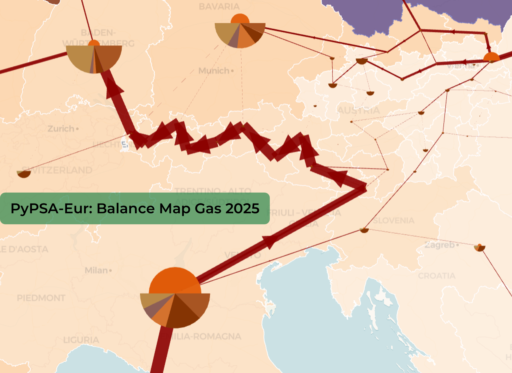

# Modified brownfield of the Austrian gas grid
## PyPSA-Eur default
The default dataset used in PyPSA-Eur is the [SciGRID_gas](https://zenodo.org/records/4767098) dataset. While this is a reasonably accurate dataset for the low spatial resolution of PyPSA-Eur, a more refined resolution on a sub-national level is not given. 
The values for capacities given for transport corridors between Austrian regions when using a NUTS3 clustering especially are not realistic and need to be improved for a truly sector-coupled consideration of the Austrian energy system. 


{ height="500" }

{ height="500" }


## In PyPSA-AT 
PyPSA-AT is hosted and maintained by the [Austrian Gas Grid Management GmbH](https://www.aggm.at/en/). This means that PyPSA-AT can be supplied directly with expert knowledge of the complete Austrian brownfield gas grid. 
In collaboration with those experts, two datasets for Austria were generated and added to PyPSA-AT in the `/data/pypsa-at/` folder. 

The two datasets represent NUTS2 (ten Austrian regions, file `AGGM_gas_network_base_AT10.csv`) and NUTS3 (35 Austrian regions, file `AGGM_gas_network_base_AT35.csv`) clustering. They contain especially data on the link capacities between regions ("transport corridors") and their respective lengths. Data on pipeline diameter is not added and will not be added due to reasons of confidentiality. 

Only those two AT clusterings are supported. 

## Rule `modify_brownfield_gas_network_AT` 
To overwrite the original dataset for Austrian regions, a new rule was introduced. It is built between the existing rules `cluster_gas_network` and `prepare_sector_network`. The new rule takes the output of the clustering rule, modifies it, and returns its output to `prepare_sector_network`. If the config setting for modification of the Austrian brownfield is disabled, the rule is still called, but only passes the input through, preserving the original workflow. 

## In `config.at.yaml` 
The changes added by this improved dataset can be turned on via the config setting 
`modify_brownfield_gas_network_AT`:  
```yaml 
mods: 
    modify_brownfield_gas_network_AT: true
```

---
# Extendable pipeline capacity and new pipelines 
In addition to the data update, two more tightly linked changes to the gas network were added. 

## Non-extendable pipeline capacities before a threshold year
In `modify_prenetwork`, gas pipeline objects are set to be non-extendable until a given threshold year. This threshold year can be set with the config setting `threshold_year_for_gas_grid_expansion`. If no threshold year is given, the default year set is 2040. 
In config.at.yaml: 
```yaml 
mods: 
  threshold_year_for_gas_grid_expansion: 2035
```

## No new methane pipelines 
To conform with reality, where no large scale expansion of the methane grid is planned, all newly built gas pipelines with carrier type `gas pipeline new` are set to be non-extendable.

